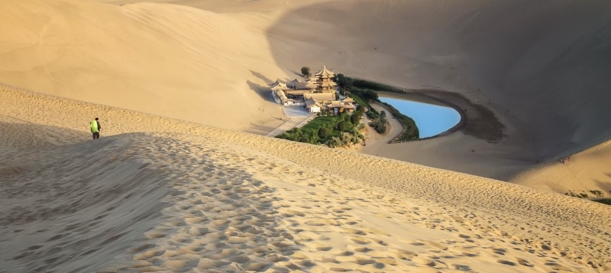

# 鸣沙山月牙泉 Mingsha Mountain And Crescent Spring

{ class="img-AttractionsBanner" }

!!! info inline end "时效性提示"
    
    内容可能随时间推移存在时效性，请注意辨别！

    内容近期更新于 2024年4月22日 

**地址：**中国甘肃省酒泉市敦煌市鸣山路 [导航前往](https://ditu.amap.com/search?query=%E9%B8%A3%E6%B2%99%E5%B1%B1%E6%9C%88%E7%89%99%E6%B3%89&city=620900&geoobj=94.790076%7C40.035734%7C94.830626%7C40.052614&zoom=15.02?_blank)
    
**开放时间：**景区分时开放  03月04日-03月09日 07:30-18:00开放； 03月10日-04月19日 07:00-19:00开放； 04月20日-12月31日 06:00-19:30开放。

**官方电话：**[0937-8882074](tel:0937-8882074), [0937-8883388](tel:0937-8883388), [0937-8883389](tel:0937-8883389)

### 介绍

鸣沙山月牙泉位于敦煌市区以南，这里沙山与泉水共处，历来以“沙漠奇观”闻名于世，是敦煌的名片之一。在这里你既可以爬上鸣沙山，俯瞰月牙泉，还能在山顶上欣赏大漠日落，感受西北大漠的苍凉广阔。

虽然历来水火不能相容，但是月牙泉却安然处在这一片沙山之中。月牙泉位于鸣沙山下，处在沙丘环抱之中，因为地势的关系，刮风时沙子不往山下走，而是往山上流动，所以月牙泉永远不被沙子埋没，被誉为“沙漠之眼”。

鸣沙山的山体由流沙堆积而成，远远望去，沙丘高低起伏，蔚为壮观。游览景区建议安排在下午，这样既可以避开中午沙漠中的酷热，还能在夕阳西下时，爬到山顶遥望远处的沙海和山下的月牙泉，观看唯美的日落。

景区目前提供多种游乐项目，如：骑骆驼、滑沙、滑草、沙漠摩托车、射箭、直升飞机游览等，其中骑骆驼和滑沙较受游客欢迎，值得体验。

游客进入景区后，游客可以直接爬上鸣沙山，欣赏完景色后，选择滑沙下山。当你从山顶下滑时，会听到“咚咚咚”的响声，似敲锣打鼓，让人胆战心惊又颇感刺激，鸣沙山因此得名。

### 优待政策

- 老人：60周岁(含)-69周岁(含)周岁，(小于70周岁) 老年人凭本人身份证原件享受半价门票。，半价；70周岁(含)以上老年人凭本人身份证原件享受免票\免费。
- 学生：国外在读的中国留学生 (本科及以下) 凭本人身份证及学生证享受半价门票\半价。
- 军人：现役军人(土兵证)、武警、伤残军人、文职干部、军队离退休干部、军校学员凭身份证和相关有效证件享受免票(退役军人不享受优惠政策)\免费。
- 消防救援人员：消防救援人员持本人身份证及能识别消防救援人员身份的有效证件享受免票\免费。
- 残疾人：持身份证和民政部门颁发的《中华人民共和国残疾人证》的残疾人享受免票\免费。
- 警察：凡持有人民警察证(辅警)的警察凭身份证和有效证件可享受免票\免费。
- 导游：持导游证(领队)、身份证、带团计划书(派团单) 三证合一方可享受导游免票\免费。
- 陇原人才服务卡：陇原人才服务卡:持陇原人才服务卡证及身份证同时出示可享受免票\免费；注：A卡可随行4人，B卡可随行3人，可随行2人，D卡可随行1人。
- 酒泉地区、嘉峪关市市民优惠：1.敦煌市民凭本人身份证原件享受免票，敦煌的在校学生购票须出示身份证或户口簿； 2.青海油田基地居民须同时出示蓝皮户口簿和身份证享受免票，户口迁出者不享受优惠政策； 3.来敦常住投资者、创业者凭本人身份证和居住证原件享受免票\免费； 4.酒泉七县市、嘉峪关两市市民凭个人身份证享受免票\免费。
- 儿童：1.2米(不含)以下，免费

补充说明：

1. 以上享受优惠政策者只对国内证件(原件)持有者本人有效。
2. 以上信息仅供参考,具体信息请以景区当天披露为准。

### 服务设施

**停车场：**【鸣沙山月牙泉停车场】参考价格：白天5元，过夜10元；地址：鸣沙山月牙泉大门口处；库位：500

**卫生间：**景区门口设有一个卫生间，四个观景台分别有四个卫生间