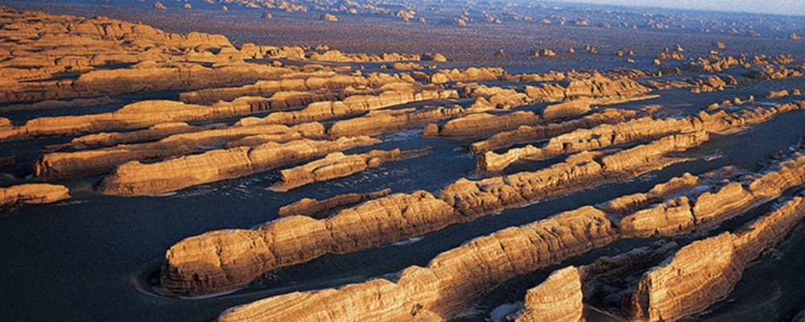

# 雅丹地质公园 Yadan Geopark

!!! info inline end "时效性提示"
    
    内容可能随时间推移存在时效性，请注意辨别！

    内容近期更新于 2024年4月29日 

**地址：**酒泉市敦煌市西北约180公里处 [导航前往](https://ditu.amap.com/search?id=B03A9140A8&city=620982&geoobj=94.654051%7C40.132266%7C94.768903%7C40.180636&query_type=IDQ&query=%E6%95%A6%E7%85%8C%E4%B8%96%E7%95%8C%E5%9C%B0%E8%B4%A8%E5%85%AC%E5%9B%AD%E9%9B%85%E4%B8%B9%E6%99%AF%E5%8C%BA&zoom=13.52?_blank)
    
**开放时间：**全年 06:30-19:00 开放

**官方电话：**[0937-5900110](tel:0937-5900110)

### 介绍

敦煌雅丹地质公园又称敦煌魔鬼城，位于敦煌市西北180公里的戈壁上，是游客游玩敦煌西线（包含玉门关、汉长城、阳关、西千佛洞等景点）的重要景观。

公园里以大片的独特雅丹地貌群为主，在戈壁之上显得奇幻壮观，而每到傍晚时夕阳西照，更是拍摄摄影大片的绝妙地点。

魔鬼城的面积很大，长约有25公里，宽13公里，里面成片的分布着各种各样造型各异的风蚀地貌景观。景区内有北线和南线两个区域，游客可以乘区间车游玩北线后即结束游玩，大约全程1.5-2小时左右。也可以在游玩北线后乘坐越野车再游玩南线，这样的环线游玩共需要3-4小时左右。

景区的区间车上配备导游，游客进入景区后需乘坐区间车游玩，区间车会停靠在园内北线上的4个景点，分别是金狮迎宾、金字塔、孔雀和西海舰队。游客全程乘坐同一辆车游玩，每个景点停靠约10-30分钟。金狮迎宾、金字塔、孔雀均是单个的风蚀石山，造型与其名字十分相似。而西海舰队则是一片地貌群，这个景点也是四个观景点中尤为壮观的一个，一座座形似舰队造型的战船土山，平行分布在戈壁之上，真的好像一支舰队，非常独特。另外，在车辆不停靠的区域，两旁也有很多独特的风蚀岩体，造型各异，所以在乘车时也不要错过。

到达西海战舰后可以随车原路返回结束游玩，也可以再乘坐越野车深入到南线。南线的面积比北线更大，景观也更多，有多个名人的头像、卡通形象等，还有金龟戏蟾、二龙戏珠、天生桥等，多种多样。而且此处还有沙漠景观，可以进入沙漠游玩，一起在沙漠里拍摄日落等。乘车时可以与司机商量，在自己喜欢的景点前停车拍照，比较随意，所以乘坐越野车还是比较值得的。

### 优待政策

- 儿童：儿童1.2米（含）-1.4米（含），18周岁（不含）以下【半价】；
- 老人：70周岁（含）以上，免费；老人60周岁（含）-69周岁（含）【半价】；
- 学生：学生全日制本科及以下在读，【半价】；
- 残疾人：持残疾证、军残证，【免费】；
- 记者：持中国新闻出版暑颁发的记者证，【免费】；
- 军人：中国现役军人（持军官、士官、学员、武警），【免费】；
- 导游：持旅行社派团单，【免费】。

补充说明：

1. 以上信息仅供参考,具体信息请以景区当天披露为准。

### 服务设施

**园内交通**：

- 参考价格：无；
- 地址：游客服务中心；