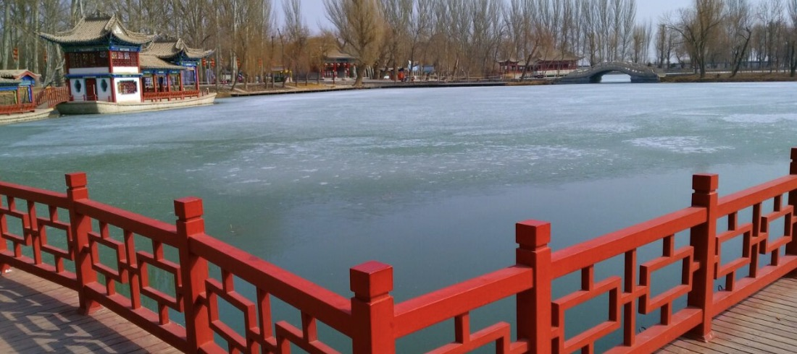

# 西汉酒泉胜迹 Park for Jiuquan

{ class="img-AttractionsBanner" }

!!! info inline end "时效性提示"
    
    内容可能随时间推移存在时效性，请注意辨别！

    内容近期更新于 2024年4月29日 

**地址：**中国甘肃省酒泉市肃州区城东 1.9 公里处 [导航前往](https://ditu.amap.com/search?id=B03A9007J6&city=620902&geoobj=92.994366%7C40.43608%7C93.273744%7C40.553154&query_type=IDQ&query=%E8%A5%BF%E6%B1%89%E9%85%92%E6%B3%89%E8%83%9C%E8%BF%B9&zoom=12.24?_blank)
    
**开放时间：** 冬春季 08:00-20:30开放 夏季 07:00-21:00开放 秋季 07:00-21:00开放。

**官方电话：**[0937-2633441](tel:0937-2633441), [0937-2630858](tel:0937-2630858)

### 介绍

酒泉西汉胜迹又名酒泉公园、泉湖公园，是酒泉市区内的标志性景点。传说汉朝大将霍去病将军在取得胜利后获得皇帝赏赐的一坛酒，将军将酒倒入泉中与将士一起饮用，因此这眼泉水得名酒泉，这也是如今酒泉市名称的由来。大多数游客来到酒泉市区，均会到这里参观游玩。

酒泉西汉胜迹景区是一座完整的汉式园林，这里既是一处知名的景区，也因环境优雅成为当地市民散步、晨练常来的地方。园子据说是由左宗棠将军出资修建，这里有中式园林的湖水、假山、亭台楼阁等，内部种植了很多树木，环境很是优美。公园较核心的区域便是名叫酒泉的这眼泉水，泉水旁有一座“西汉胜迹”古碑，也是公园内的一个标志，可以拍照留影。

### 优待政策

- 免费游览。

### 服务设施

**餐饮：**夏季提供烧烤、酒水