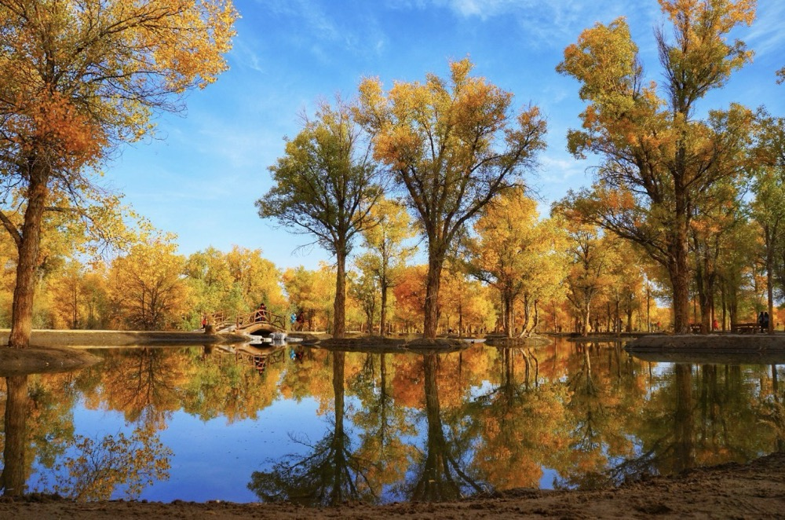

# 酒泉市 Jiuquan City

酒泉市，古称肃州，是甘肃省辖地级市，甘肃省人民政府批复确定的丝绸之路经济带甘肃段重要节点城市、省域副中心城市。截至2023年1月，酒泉市辖1个区、2个县级市、4个县，总面积19.2万平方公里，占甘肃省面积的42%，其中土地总面积16.81万平方公里、湿地面积4.8万平方公里、耕地面积460.04万亩。截至2022年末，酒泉市常住人口105.31万人。

酒泉市地处中国西北地区、甘肃省西北部、河西走廊西端，东接甘肃省张掖市和内蒙古自治区，南接青海省，西接新疆维吾尔自治区，北接蒙古国，自古就是通往新疆和西域的交通要塞。酒泉市为汉代河西四郡之一，丝绸之路的重镇，因“城下有泉”、“其水若酒”而得名。酒泉市是敦煌艺术的故乡，现代航天的摇篮、新中国石油和核工业的发祥地、“铁人精神”的诞生地。先后获影响世界的中国文化旅游名城、中国最具国际影响力旅游目的地等荣誉称号。酒泉市境内有敦煌莫高窟、安西锁阳城、酒泉公园（西汉酒泉胜迹）、敦煌雅丹国家地质公园等旅游景点。

## 地域信息

|  |  |  |  |
| ---------- | --------- | ------------ | -------------- |
| **中文名称** | 酒泉市  | **著名景点** | 莫高窟、酒泉公园、敦煌雅丹国家地质公园、鸣沙山月牙泉景区 |
| **英文名称** | Jiuquan City  | **机场** | 嘉峪关酒泉机场，敦煌莫高国际机场 |
| **别名** | 肃州  | **火车站** | 酒泉站（客货两运），酒泉南站（客运） |
| **行政区级别** | 地级市  | **气候条件** | 大陆性干旱气候 |
| **面积** | 168100 km2  |  |  |

## 辖下区划

截至2023年1月，酒泉市下辖：肃州区1个区，玉门市、敦煌市2个县级市，金塔县、瓜州县2个县，肃北蒙古族自治县、阿克塞哈萨克族自治县2个自治县。

=== "肃州区"
    
    **区划名称：**肃州区

    **区划面积（km2）：**3386

    **区划详情：**
    
    街道7：东北街街道、东南街街道、西北街街道、西南街街道、新城街道、工业园街道、玉门油田生活基地街道
    
    镇14：西洞镇、清水镇、总寨镇、金佛寺镇、上坝镇、三墩镇、银达镇、西峰镇、泉湖镇、果园镇、东洞镇、丰乐镇、下河清镇、铧尖镇
    
    乡1：黄泥堡裕固族乡
    
=== "敦煌市"

    **区划名称：**敦煌市

    **区划面积（km2）：**31200

    **区划详情：**
    
    镇9：沙州镇、肃州镇、莫高镇、转渠口镇、七里镇、月牙泉镇、郭家堡镇、黄渠镇
    
=== "玉门市"

    **区划名称：**玉门市

    **区划面积（km2）：**13389

    **区划详情：**
    
    街道1：新市区街道
    
    镇10：玉门镇、赤金镇、花海镇、老君庙镇、黄闸湾镇、下西号镇、柳河镇、昌马镇、柳湖镇、六墩镇
    
    乡2：小金湾东乡族乡、独山子东乡族乡

=== "金塔县"

    

    **区划名称：**金塔县

    **区划面积（km2）：**18800

    **区划详情：**
    
    镇7：中东镇、鼎新镇、金塔镇、东坝镇、航天镇、大庄子镇、西坝镇
    
    乡2：古城乡、羊井子湾乡

=== "瓜州县"

    **区划名称：**瓜州县

    **区划面积（km2）：**24100

    **区划详情：**
    
    镇10：渊泉镇、柳园镇、三道沟镇、南岔镇、锁阳城镇、瓜州镇、西湖镇、河东镇、双塔镇、腰站子东乡族镇
    
    乡5：布隆吉乡、七墩回族东乡族乡、广至藏族乡、沙河回族乡、梁湖乡

=== "肃北蒙古族自治县"

    **区划名称：**肃北蒙古族自治县

    **区划面积（km2）：**66748

    **区划详情：**
    
    镇2：党城湾镇、马鬃山镇
    
    乡2：盐池湾乡、石包城乡

=== "阿克塞哈萨克族自治县"

    **区划名称：**阿克塞哈萨克族自治县

    **区划面积（km2）：**32374

    **区划详情：**
    
    镇1：红柳湾镇
    
    乡3：阿克旗乡、阿勒腾乡、阿伊纳乡

## 游玩景点

-   :palm_tree:{ .lg .middle } __莫高窟__

    ---

    **地址：**中国甘肃省敦煌市东南25公里处莫高镇的鸣沙山东麓断崖上
    
    **开放时间：**景区分时开放，分时预约

    12月1日-3月31日 09:00-17:30开放
    
    4月1日-11月30日 08:00-18:00开放

    [:octicons-arrow-right-24: 详细信息](../../AttractionGuide/Dunhuang_Mogaoku)

-   :palm_tree:{ .lg .middle } __莫高窟__

    ---

    **地址：**中国甘肃省敦煌市东南25公里处莫高镇的鸣沙山东麓断崖上
    
    **开放时间：**景区分时开放，分时预约

    12月1日-3月31日 09:00-17:30开放
    
    4月1日-11月30日 08:00-18:00开放

    [:octicons-arrow-right-24: 详细信息](#)

-   :palm_tree:{ .lg .middle } __莫高窟__

    ---

    **地址：**中国甘肃省敦煌市东南25公里处莫高镇的鸣沙山东麓断崖上
    
    **开放时间：**景区分时开放，分时预约

    12月1日-3月31日 09:00-17:30开放
    
    4月1日-11月30日 08:00-18:00开放

    [:octicons-arrow-right-24: 详细信息](#)

-   :palm_tree:{ .lg .middle } __莫高窟__

    ---

    **地址：**中国甘肃省敦煌市东南25公里处莫高镇的鸣沙山东麓断崖上
    
    **开放时间：**景区分时开放，分时预约

    12月1日-3月31日 09:00-17:30开放
    
    4月1日-11月30日 08:00-18:00开放

    [:octicons-arrow-right-24: 详细信息](#)

