# 市州景点

{ align=left width="300px" }

**兰州市** 
甘肃省省会，享有“丝路重镇”、“黄河明珠”、“西部夏宫”、“水车之都”、“瓜果名城”等美誉。始建于西汉始元元年（前86年），因初次在这里筑城时挖出金子，故取名金城，还有一种说法是依据“金城汤池”的典故，喻其坚固。总面积1.31万平方千米，辖5区3县：城关区、七里河区、西固区、安宁区、红古区、永登县、榆中县、皋兰县。

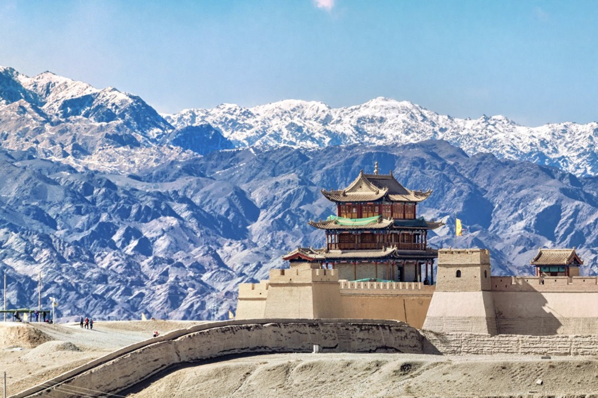{ align=right width="300px" }

**嘉峪关市** 
嘉峪关市是明代万里长城的西端起点，因1958年国家“一五”计划重点项目“酒泉钢铁公司”的建设而兴起的一座新兴工业旅游现代化区域中心城市。辖区内的嘉峪关长城素有“天下第一雄关”、“边陲锁钥”之称。嘉峪关市是中国四个不设市辖区的地级市之一，辖8街道3镇，总面积2935平方千米。  

{ align=left width="300px" }

**金昌市** 
地处河西走廊中段，为古丝绸之路重要节点城市和河西走廊主要城市之一，区域年均蒸发量是降水量的18倍，也是中国西部地区自然生态环境比较脆弱的地区。金昌缘矿兴企、因企设市，因盛产镍被誉为“祖国的镍都”。总面积8896平方千米，辖1区1县：金川区、永昌县。

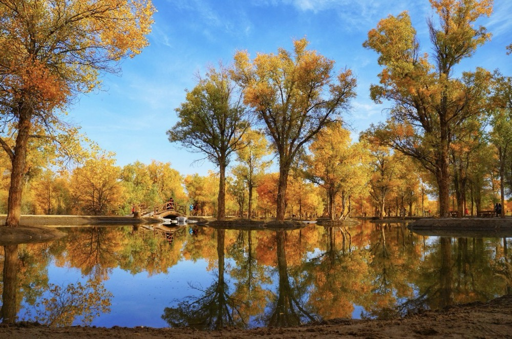{ align=right width="300px" }

<a href="Jiuquan"> **酒泉市**  </a>
位于甘肃省西北部河西走廊西端的阿尔金山、祁连山与马鬃山（北山）之间。是敦煌艺术的故乡、现代航天的摇篮、新中国石油和核工业的发祥地、“铁人”王进喜的故乡和“铁人精神”的诞生地。总面积19.2万平方千米，占甘肃省面积的42%，辖1区4县2市：肃州区、金塔县、瓜州县、肃北蒙古族自治县、阿克塞哈萨克族自治县、玉门市、敦煌市。

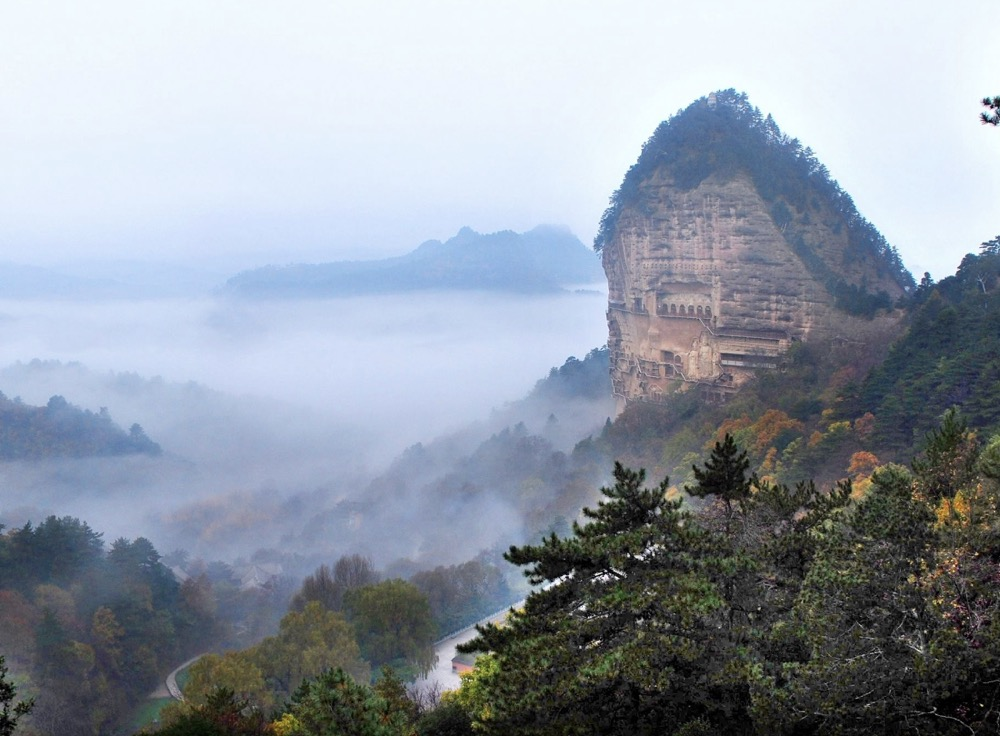{ align=left width="300px" }

**天水市** 
地处陕、甘、川三省交界，以西秦岭为分水岭，北部地区面积11673平方千米，占全市总面积的81.49%；南部地区面积2652平方千米，占全市总面积的18.51%。总面积14325平方千米。辖2区5县：秦州区、麦积区、甘谷县、武山县、秦安县、清水县、张家川回族自治县。   

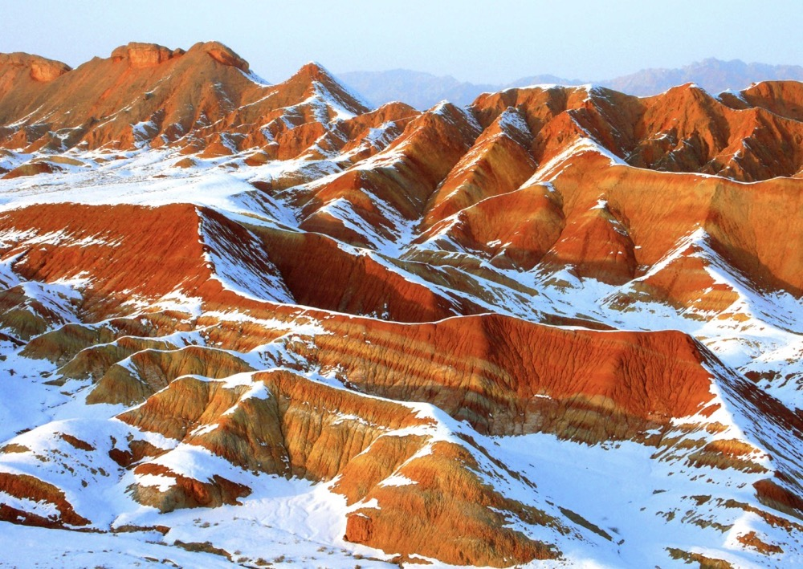{ align=right width="300px" }

**张掖市** 
地处甘肃省河西走廊中部，其名取“张国臂掖，以通西域”之意。张掖市历史悠久，是全国历史文化名城之一。西汉元鼎六年（前111年）建张掖郡，这里遂成为军事战略要地，丝绸之路重镇，东西经济文化交流的通道。总面积4.2万平方千米，辖1区5县：甘州区、山丹县、民乐县、临泽县、高台县、肃南裕固族自治县。  

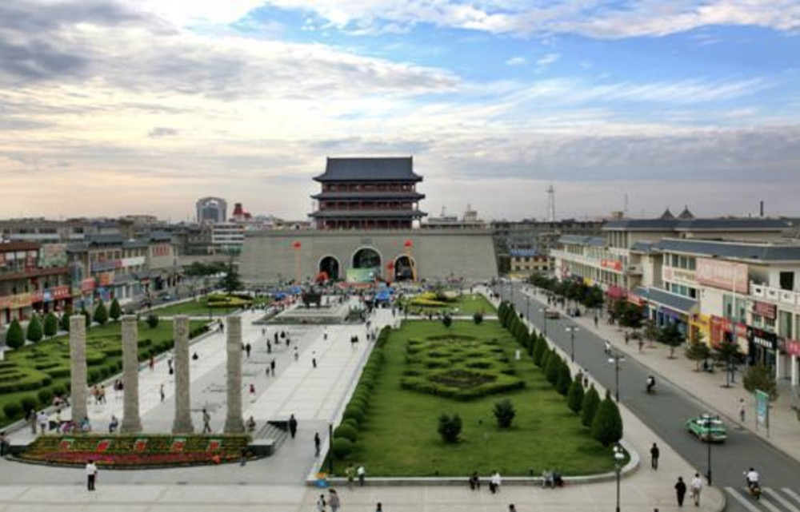{ align=left width="300px" }

**武威市** 
位于甘肃省中部、河西走廊东端，是中国旅游标志——马踏飞燕的出土地。武威历史悠久，西汉元狩二年（前121年），汉武帝派骠骑将军霍去病远征河西，击败匈奴，为彰其“武功军威”命名武威。武威是古丝绸之路要冲，境内名胜古迹众多。总面积3.23万平方千米，辖1区3县：凉州区、民勤县、古浪县和天祝藏族自治县。

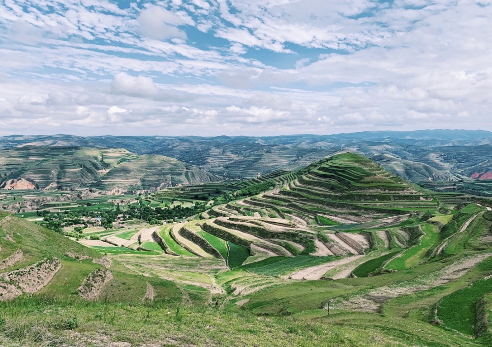{ align=right width="300px" }

**定西市** 
位于甘肃中部，通称“陇中”。岷山、陇川不仅孕育了马家窑、齐家、寺洼、辛店等史前文化，也传承着汉唐古风，使定西成为“丝绸之路”的重要通道、中华民族黄河文明的重要发祥地之一。是甘肃中部的经济、政治、文化和交通中心。总面积1.96万平方千米，辖1区6县：安定区、通渭县、陇西县、渭源县、临洮县、漳县、岷县。  

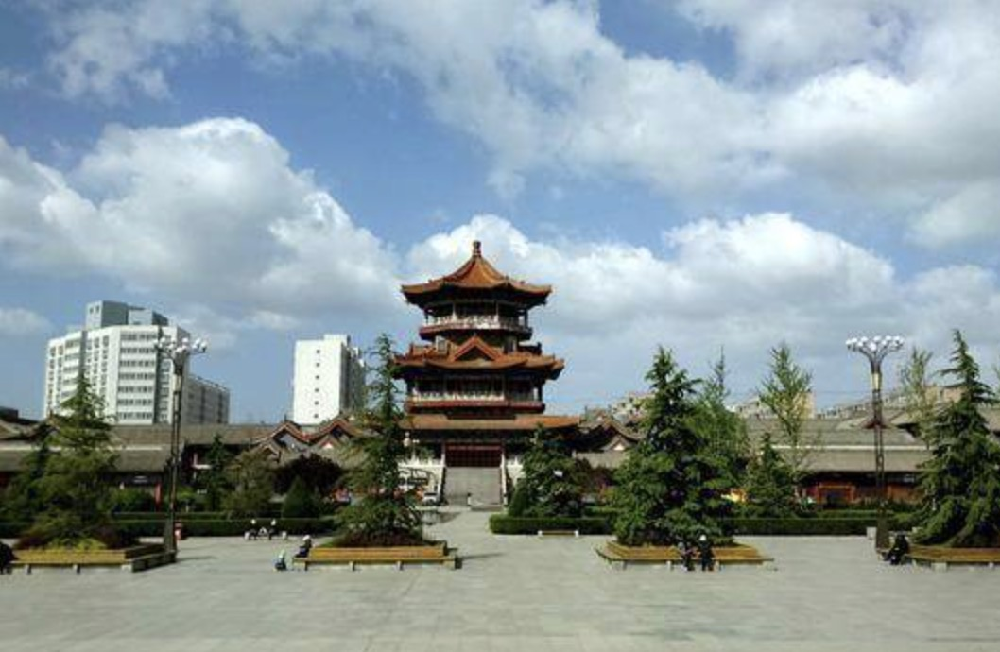{ align=left width="300px" }

**平凉市** 
地处陕、甘、宁三省（区）交汇处，是中华文明的发祥地之一，前秦建元十二年（376年），前秦灭前凉，置平凉郡，取“平定凉国”之意，平凉之名始见于史册。是甘肃东部重要的区域性中心城市和承接中东部省区产业转移与开放开发的“东大门”。总面积1.1万平方千米，辖1区5县1市：崆峒区、泾川县、灵台县、崇信县、庄浪县、静宁县、华亭市。

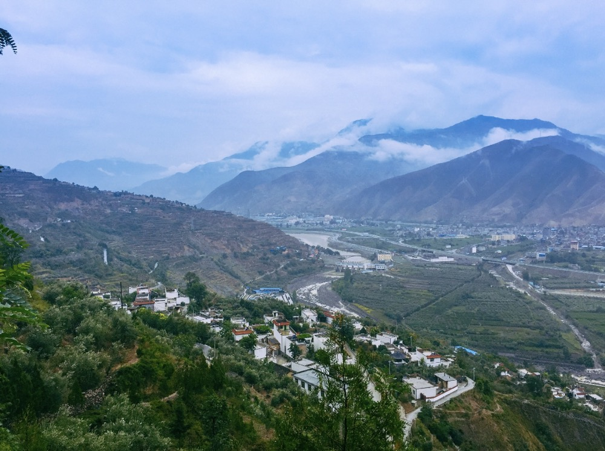{ align=right width="300px" }

**陇南市** 
位于甘肃省东南部，地处秦巴山区，东接陕西，南通四川，扼陕甘川三省要冲，素称“秦陇锁钥，巴蜀咽喉”。陇南是甘肃省唯一属于长江水系并拥有亚热带气候的地区，被誉为“陇上江南”。境内高山、河谷、丘陵、盆地交错，气候垂直分布，地域差异明显。总面积2.79万平方千米，辖1区8县：武都区、成县、文县、宕昌县、康县、西和县、礼县、徽县、两当县。  

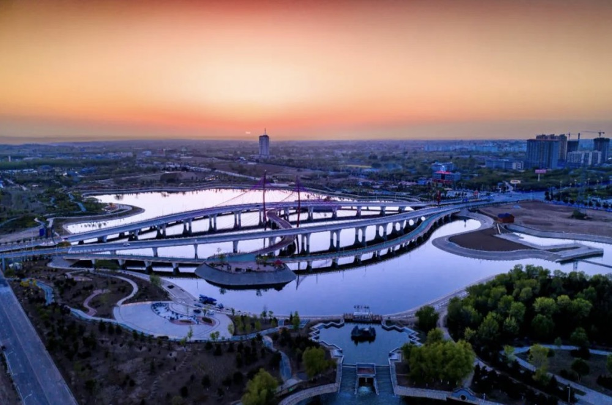{ align=left width="300px" }

**庆阳市** 
位于甘肃东部、陕甘宁三省区交会处。庆阳先民、中医鼻祖岐伯曾在此与黄帝论医，成就了中华医学巨著《黄帝内经》，被联合国教科文卫组织列入世界记忆名录。庆阳香包、陇绣、民间剪纸、道情皮影等民俗文化独树一帜。总面积2.7万平方千米，辖1区7县：西峰区、庆城县、华池县、宁县、镇原县、合水县、正宁县、环县。

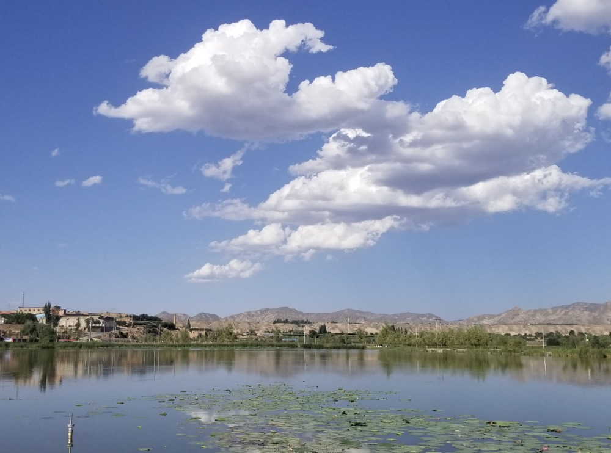{ align=right width="300px" }

**白银市** 
位于黄河上游、甘肃省中部。志书记载，白银矿藏的开采，始于汉代，明朝洪武年间，官方曾在现市政府驻地设立办矿机构“白银厂”，有“日出斗金”之说，白银缘此而得名。总面积2.12万平方千米，占甘肃总面积的4.4%。辖2区3县：白银区、平川区、会宁县、靖远县、景泰县。    

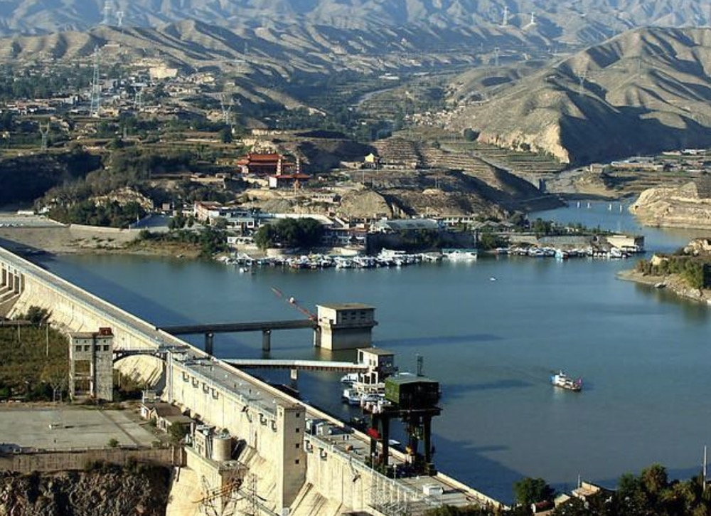{ align=left width="300px" }

**临夏回族自治州** 
位于黄河上游、甘肃省中部西南面，是古丝绸之路南道要冲，也是文成公主进藏时的途经之地。临夏是中华文明的重要起源地之一，是中国新石器文化最集中、考古发掘最多的地区之一，被誉为“中国彩陶之乡”。总面积8169平方千米，辖7县1市：临夏县、永靖县、广河县、和政县、康乐县、东乡族自治县、积石山保安族东乡族撒拉族自治县、临夏市。  

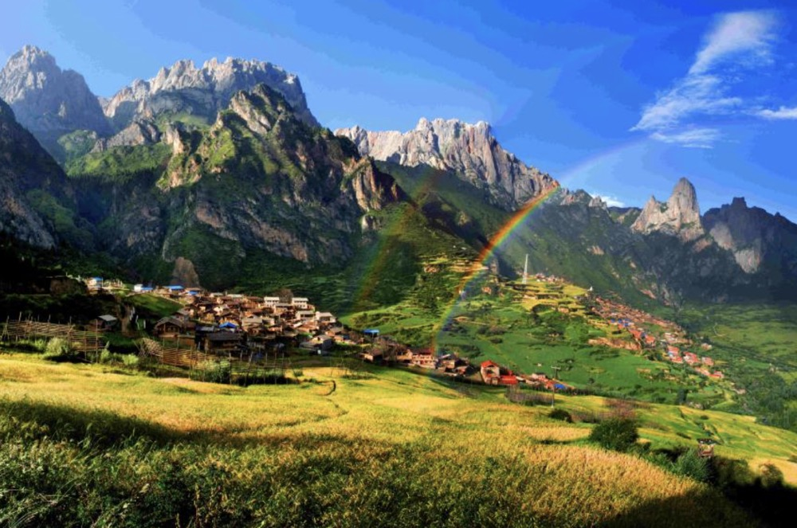{ align=right width="300px" }

**甘南藏族自治州** 
地处青藏高原与黄土高原过渡的甘、青、川三省结合部，是全国的“五大牧区”之一。境内有有全国文物保护单位的夏河拉卜楞寺等121座藏传佛教寺院；有红军长征经历的天险腊子口等十多处革命历史遗迹；被誉为“中国的小西藏，甘肃的后花园”。总面积4.5万平方千米，辖7县1市：夏河县、碌曲县、玛曲县、迭部县、舟曲县、临潭县、卓尼县、合作市。
